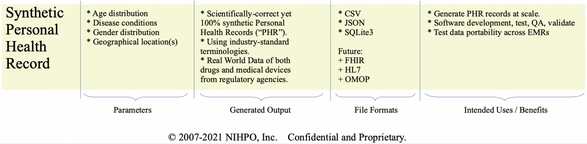
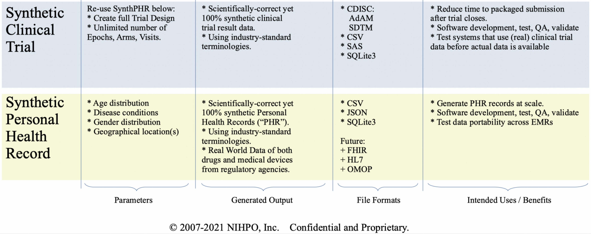

# NIHPO's Synthetic Health Data Platform
NIHPO’s Synthetic Health Data Platform helps *all staff roles* at *life sciences companies* to *reduce the time* it takes to 
* design, 
* develop, 
* test, 
* validate, and
* obtain regulatory approval for
new *drugs* and *medical devices*.

We empower Business Users to become Citizen Developers.

## Create Unencumbered Synthetic Health Data at Scale
100% scientifically valid (LOINC, SNOMED-CT)

Real World Data (devices; drugs; US providers)

Synthetic data significantly reduces time to:
* Test, validate trial software
* Predict, solve trial data issues early
* Compile trial data into full submission

Enroll SynthPatients in SynthTrials and build a full SynthSubmission for end-to-end test, QA, validation

## The Problem we Solve
Access to realistic, unencumbered health data:
* Before real clinical trial data becomes available
* Assist during clinical
* Software Development
* Software Testing: Fuzz Testing, corner cases
* Shorten Quality Assurance cycles
* Crucial for end-to-end System Validation

With no copyright, legal, privacy, regulatory blocks.

## Who has This Problem?
* Pharmaceutical companies (“Sponsors”)
* Clinical Research Organizations (“CROs”)
* Hospitals testing inter-operability, migrations 
* Health IT providers / vendors
* Regulatory Agencies
* Software developers

NIHPO is working towards a full, end-to-end “Computable Clinical Trial Data Platform”

## SynthPHR
a.) User generates Synthetic Personal Health Records ("SynthPHRs") on demand, at scale.
User can create synthetic cohorts at will: assign gender distribution; define age ranges; select countries; include / exclude pre-existing disease types; etc.
The generated SynthPHR files are saved in the user's account. And available for download.

Please see the [SynthPHR](/synthphr) section for more details.

## SynthTrial
b.) User runs the pre-generated synthetic cohorts through a Synthetic Clinical Trial.
Select a pre-defined "Synthetic PHR" created above, define a clinical trial (arms, phases, visits, etc.), and "run" the cohort through the trial.
User will be able to re-run the same cohort through as many trials as needed.
The system will generate the full output for a trial (CDISC-formatted files, in both CSV and SAS format).
The generated SynthTrial files are saved in the user's account. And available for download.

Please see the [SynthTrial](/synthtrial) section for more details.

## SynthSubmission
c.) User selects a pre-defined SynthTrial and we'll build a Docker image with a full "Computable Clinical Trial Submission".
The Docker image will include all the CDISC SDTM files, plus the SynthPHRs, plus other files we're working on.

Please see the [SynthSubmission](/synthsubmission) section for more details.

Users will be able to boot the Docker image in Azure, as a full self-contained regulatory submission.

## User Benefits

Imagine this: a user will be able to go from zero to a fully computable (synthetic) regulatory submission in under an hour.
Accessible through a web browser, hosted in Azure, with no IT intervention.
How many hours of drudgery and copy-and-paste work can we save to staffers in medical device and Pharma companies? 

# License Notice
Please note that this software is licensed under the [GNU AGPL](https://www.gnu.org/licenses/why-affero-gpl.html).
[Contact NIHPO](Jose.Lacal@NIHPO.com) for a commercial license, or if you're interested in licensing a customized version of this platform.

:copyright: 2007-2021 NIHPO, Inc.