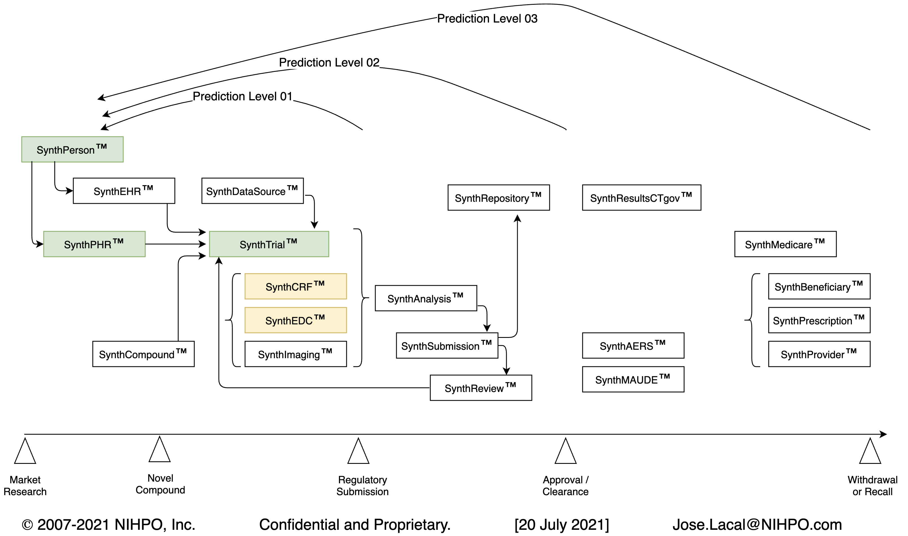

# NIHPO's Synthetic Health Data Platform

## About Our Platform

Lifesciences companies need access to unencumbered health data to accelerate their development, testing, and validation processes. Realistic, scientifically-valid yet synthetic health data can help shrink the regulatory approval timeline.

NIHPO’s Synthetic Health Data Platform helps *all staff roles* at *life sciences companies* to *reduce the time* it takes to 
* design, 
* develop, 
* test, 
* validate, and
* obtain regulatory approval for
new *drugs* and *medical devices*.

The Platform programmatically generates realistic, 100% scientifically correct, yet fully synthetic people ("SynthPerson").
For each SynthPerson the platform generates a complete synthetic Personal Health Record ("SynthPHR").
SynthPatients live in a series of geographically-accurate synthetic cities ("SynthCity"). 
SynthPatients are then randomly selected to participate in synthetic Clinical Trials ("SynthTrials"). 
Platform users define the parameters of a clinical trial and the platform generates all SDTM domains for the desired number of subjects.
Once the Synthetic Trial is generated, users can build the equivalent of a full digital Synthetic Submission ("SynthSubmission") to a Health Agency.

Our work is guided by a close collaboration with executives at pharma companies:
https://www.pharmiweb.com/press-release/2020-07-06/phuse-deploys-nihpo-platform-of-enriched-open-data-in-microsoft-azure-to-accelerate-covid-19-clinical-research

Our recent PharmaSUG 2021 Presentation
https://www.pharmasug.org/us/2021/schedule.html

https://www.pharmasug.org/us/2021/papers.html#AD-162

Here's a recording of our presentation:
http://nihpo.com/AD-162.mp4

This is the paper:
http://nihpo.com/AD-162_PharmaSUG2021_12.pdf

Know Earlier => Decide Faster

Custom Data => Focus on Work

* Realistic, unencumbered Synthetic Health Data:
* Available before First Patient In, Database Lock
* Custom format, structure meet client's exact needs
* Data matches client’s existing processes, tools
* Robust Performance Testing of client’s platform
* Fully-populated SDTM for Exploratory Analysis
* Programmatically loaded to Medidata’s Rave EDC

## Platform Modules

|Module Name | Description | Status|
--- | --- | ---
|Chemistry|
|[SynthCompound](/synthcompound)|Synthetic Compounds|Design phase|
|Subjects
|[SynthPerson](/synthperson)|Synthetic Person|Available now|
|[SynthPHR](/synthphr)|Synthetic Personal Health Record|Available now|
|[SynthEHR](/synthehr)|Synthetic Electronic Health Record|Design phase|
|Clinical Trial|
|[SynthTrial](/synthtrial)
|[SynthCRF](/synthcrf)
|[SynthEDC](/synthedc)
|[SynthImaging](/synthimaging)
|Regulatory Process|
|[SynthSubmission](/synthsubmission)|Synthetic Submission|In development|
|[SynthResultsCT.gov](/synthresultsctgov)|Synthetic results submission to ClinicalTrials.gov|Design phase|
|[SynthReview](/synthreview)|Synthetic regulatory review|Design phase|
|Post-market Surveillance|
|[SynthAERS](/synthaers)|Synthetic pharmaceutical adverse events (AERS)|Design phase|
|[SynthMAUDE](/synthmaude)|Synthetic medical device adverse events|Prototype phase|
|Medicare|
|[SynthMedicare](/synthmedicare)|Synthetic Medicare|Design phase|
|[SynthBeneficiary](/synthbeneficiary)|Synthetic beneficiary|Design phase|
|[SynthPrescription](/synthprescription)|Synthetic prescription|Design phase|
|[SynthProvider](/synthprovider)||Synthetic provider|Design phase|

## Download Docker Image

[(Docker image usage guide](http://nihpo.com/Usage_of_Docker_Image.pdf)

## Customization
the NIHPO Synthetic Health Data Platform is flexible enough to allow us to:
* Load country-specific terminologies and data.
* Generate synthetic patient data that matches the format of your existing EMRs / Health Information Systems.
* Build data to match the specifications of your hospitals' current Health Information Systems.

## A Prediction Engine

Our end goal is a bit ambitious: to build a prediction engine where a user can, from a desktop application, model and predict an entire Clinical Trial from chemical compound to market acceptance and revenue.

Our theory is that there is enough Open Data already available to create predictive models of how a particular new chemical compound may behave along the product development and marketing timeline.
Using prior (historical) data as a reference.

NIHPO already started building "Risk Profiles" of both drugs and devices:
http://nihpo.com/wp-content/uploads/Oxaliplatin.xlsx
http://nihpo.com/wp-content/uploads/Ramucirumab.xlsx
http://nihpo.com/wp-content/uploads/edwards_lifesciences.xlsx

And here's where the "Prediction Level" right-to-left arrows come in:

### Prediction Level 01:
Simulate the full regulatory submission package from the chemical structure of the new compound.

### Prediction Level 02:
Simulate taking a new compound all the way out to regulatory approval.

### Prediction Level 03:
Simulate the entire life-cycle of a new compound out to the marketing and revenue-producing stage.

## Elements of NIHPO's Synthetic Health Data Platform:
[SynthPHR](/synthphr) => [SynthEDC](/synthedc) => [SynthImaging](/synthimaging) => [SynthTrial](/synthtrial) => [SynthCRF](/synthcrf) => [SynthSubmission](/synthsubmission)

In this repository you can analyze and download the Python-based software that powers this platform.

## Intended Users

Sponsor:
* Developing software to test clinical trial data.

Software developer:
* “Not being part of a pharma company I do not have access to clinical trial data.”

CRO. 
* “We need data to speed up development of systems.”
* Creation of test data => speed up data sets?
* Starting point: “we can’t use clients’ data.”

Requirements:
* Must be conformant to latest CDISC standard.

## Create Unencumbered Synthetic Health Data at Scale

The synthetic data this platform generates is:
* 100% scientifically valid (LOINC, SNOMED-CT)
* Includes Real World Data (devices; drugs; US providers)

Synthetic data significantly reduces time to:
* Test, validate trial software
* Predict, solve trial data issues early
* Compile trial data into full submission
* "Walk" SynthPatients through SynthTrials
* Perform end-to-end test, QA, validation

## The Problem we Solve
Access to realistic, unencumbered health data:
* Before real clinical trial data becomes available
* Assist during clinical
* Software Development
* Software Testing: Fuzz Testing, corner cases
* Shorten Quality Assurance cycles
* Crucial for end-to-end System Validation

With no copyright, legal, privacy, regulatory blocks.

## Who has This Problem?
* Pharmaceutical companies (“Sponsors”)
* Clinical Research Organizations (“CROs”)
* Hospitals testing inter-operability, migrations 
* Health IT providers / vendors
* Regulatory Agencies
* Software developers

NIHPO is working towards a full, end-to-end “Computable Clinical Trial Data Platform”

## Stage I: Synthetic Personal Health Records

User can generate Synthetic Personal Health Records ("SynthPHRs") on demand, at scale.

User can create synthetic cohorts at will: assign gender distribution; define age ranges; select countries; include / exclude pre-existing disease types; etc.

The generated SynthPHR files can be downloaded.

Please see the [SynthPHR](/synthphr) section for more details.

## Stage II: Synthetic Clinical Trial

User runs the pre-generated synthetic cohorts through a Synthetic Clinical Trial.

Select a pre-defined "Synthetic PHR" created above, define a clinical trial (arms, phases, visits, etc.), and "run" the cohort through the trial.
User will be able to re-run the same cohort through as many trials as needed.

The system generates the full output for a trial (CDISC-formatted files, in both CSV and SAS format).

The generated SynthTrial files can be downloaded.

Please see the [SynthTrial](/synthtrial) section for more details.

## Stage III: Synthetic Clinical Trial Submission

User selects a pre-defined SynthTrial and builds a Docker container with a full "Computable Clinical Trial Submission".

The Docker container includes all the CDISC SDTM files, plus the SynthPHRs, plus other files we're working on.

* Fully digital trial data submission 
* Reviewer analyzes full raw data 
* Runs in self-contained Virtual Machine / Docker image
* Greatly reduce time to approval

Please see the [SynthSubmission](/synthsubmission) section for more details.

Users will be able to boot the Docker container in Azure, as a full self-contained regulatory submission.

## Stage IV: Synthetic Electronic Data Capture ("SynthEDC")

We're exploring the business value of building synthetic, unencumbered Electronic Data Capture ("EDC") datasets at scale.

Please see the [SynthEDC](/synthedc) section for more details.

## Stage V: Synthetic Case Report Form ("SynthCRF")

..

Please see the [SynthCRF](/synthcrf) section for more details.

## Stage VI: Synthetic Medical Imaging ("SynthImaging")

There seems to be a scarcity of scientifically-valid yet synthetic medical images.

We're exploring the business value of building synthetic, unencumbered Electronic Data Capture ("EDC") datasets at scale.

Please see the [SynthImaging](/synthimaging) section for more details.

## User Benefits

Imagine this: a user will be able to go from zero to a fully computable (synthetic) regulatory submission in under an hour.

Accessible through a web browser, hosted in Azure, with no IT intervention.
Or running locally through a Docker container.

How many hours of drudgery and copy-and-paste work can we save to staffers in medical device and Pharma companies? 

[SynthCompound](/synthcompound)

[SynthPerson](/synthperson)
[SynthPHR](/synthphr)
[SynthEHR](/synthehr)

[SynthTrial](/synthtrial)
[SynthCRF](/synthcrf)
[SynthEDC](/synthedc)
[SynthImaging](/synthimaging)

[SynthSubmission](/synthsubmission)
[SynthResultsCT.gov](/synthresultsctgov)
[SynthReview](/synthreview)

[SynthAERS](/synthaers)
[SynthMAUDE](/synthmaude)

[SynthMedicare](/synthmedicare)
[SynthBeneficiary](/synthbeneficiary)
[SynthPrescription](/synthprescription)
[SynthProvider](/synthprovider)

# Our Business Model
NIHPO partners with clients to solve their health data challenges through the use of synthetic data.

We’re not in the business of selling time —we sell momentum for your business. Do you want to haggle over hours, time, and costs, or do you want the ideas that will give momentum to your business?

We do not charge per hour, or per user. We sign long-term engagements where we bring all our expertise, and all our staff, to the table.
We customize our tools and services to meet each organization's unique needs. 

# Why Open Source our Intellectual Property?

NIHPO has consciously decided to publish its software's source code under the [GNU AGPL](https://www.gnu.org/licenses/why-affero-gpl.html) license from the Free Software Foundation.

At NIHPO, we define ourselves as Data Artistes. We love Open Data, and our passion is turning Open Data into actionable knowledge.

Like artists everywhere, the greatest impediment to our success is when nobody knows about our art. We want every person who could benefit from our software to be free to try the software, in their own terms, with neither financial nor legal barriers.

We believe that by demonstrating both our art and our passion for this craft, upfront and with no restrictions, we'll be able to attract subscribers willing to pay us to enhance and customize the software we're providing here for free.

We're following the [Product-led Growth](https://www.productled.org/foundations/what-is-product-led-growth) strategy. We believe that the quality of our product, and that you can try it before you buy it, will open doors for us.

# License Notice
Please note that this software is licensed under the [GNU AGPL](https://www.gnu.org/licenses/why-affero-gpl.html).

[Contact NIHPO](mailto:Jose.Lacal@NIHPO.com?subject=GitHub%20inquiry.) for a commercial license, or if you're interested in licensing a customized version of the NIHPO Synthetic Health Data Platform.

:copyright: 2007-2021 NIHPO, Inc.     Version 07 August 2021.