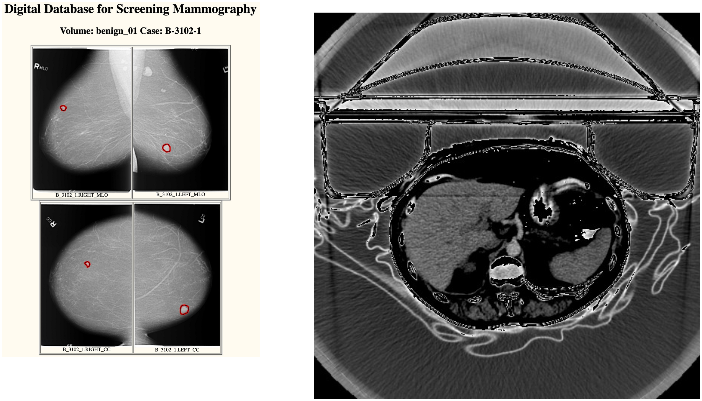

# Synthetic Medical Imaging ("SynthImaging")

There seems to be a scarcity of scientifically-valid yet synthetic medical images.

We're exploring the business value of building synthetic, unencumbered Electronic Data Capture ("EDC") datasets at scale.

The initial phases of this project are:
* Identify the 05 most common disease targets for clinical trials that use imaging.
* Generate synthetic images (both DICOM as well as JPEG) for those disease targets.
* Integrate the SynthImaging output files with our current [SynthSubmission](/synthsubmission) work.

There are massive amounts of freely-available, unencumbered real imaging data:
* [University of South Florida's "Digital Database for Screening Mammography"](http://www.eng.usf.edu/cvprg/Mammography/Database.html)
* [The Cancer Imaging Archive (TCIA)](https://www.cancerimagingarchive.net/)

Our plan is to leverage that real imaging data to then programmatically generate synthetic imaging files.

Please [contact José](mailto:Jose.Lacal@NIHPO.com?subject=SynthImaging%20inquiry.) if your organization would like to fund this work. 

# License Notice
Please note that this software is licensed under the [GNU AGPL](https://www.gnu.org/licenses/why-affero-gpl.html).

[Contact NIHPO](mailto:Jose.Lacal@NIHPO.com?subject=GitHub%20inquiry.) for a commercial license, or if you're interested in licensing a customized version of this platform.

:copyright: 2007-2021 NIHPO, Inc.     Version 29 March 2021.