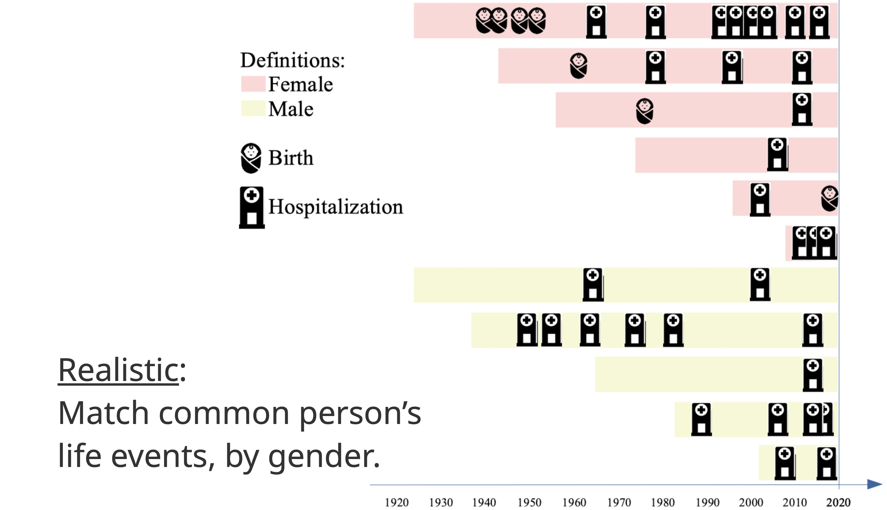
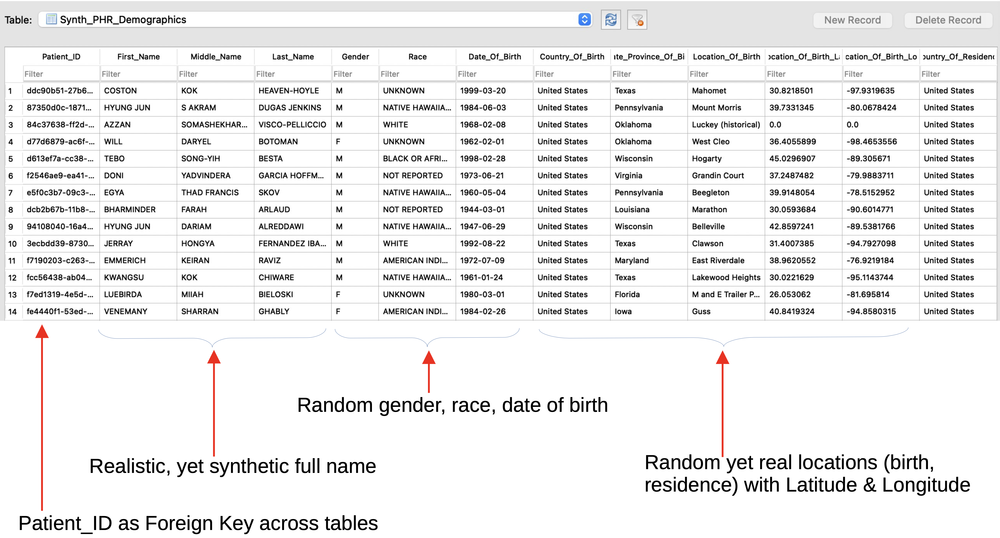
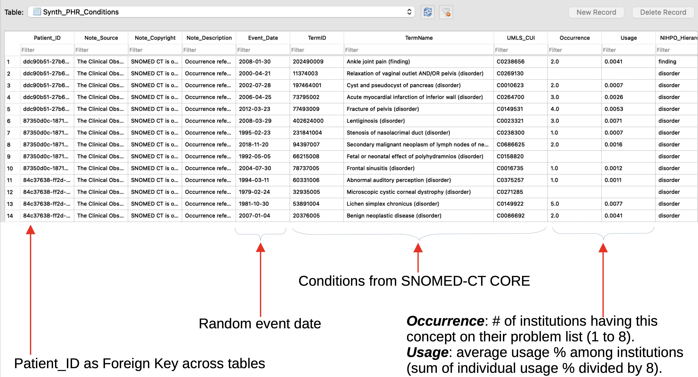
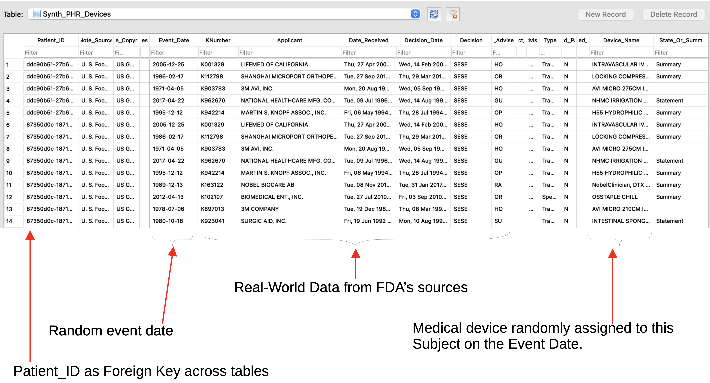
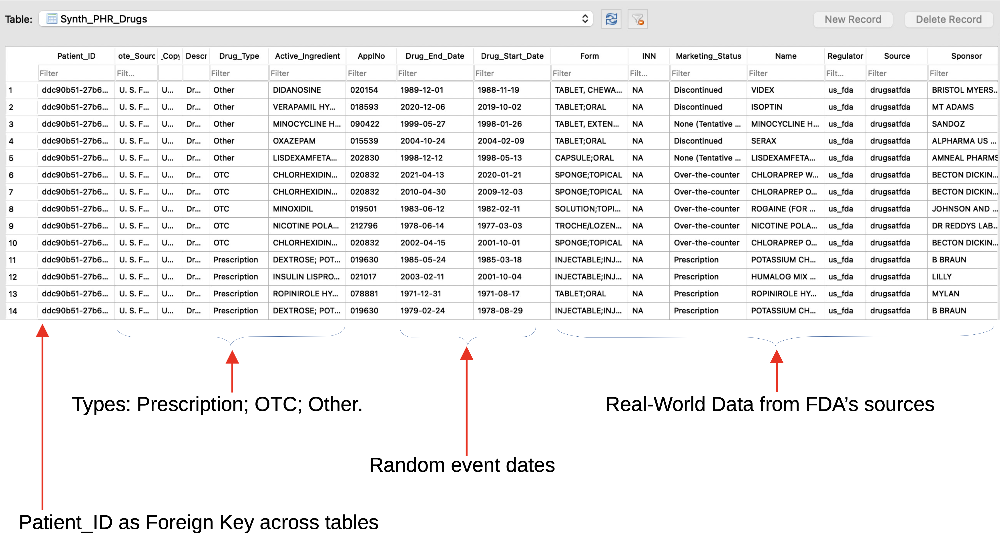
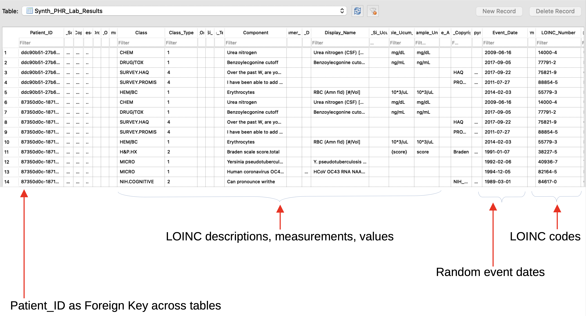
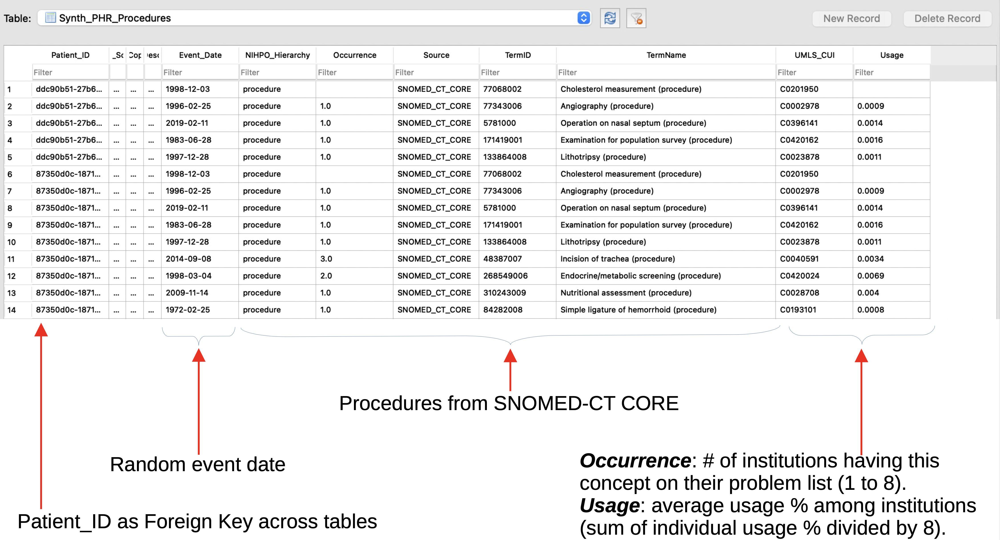
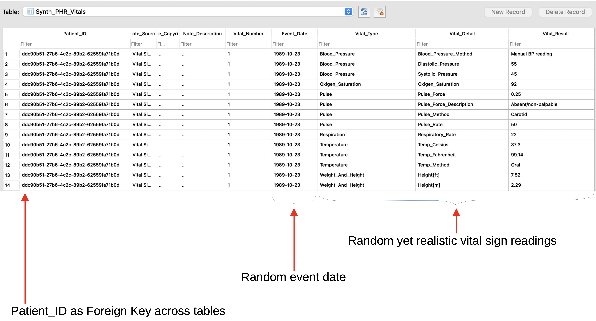

# Synthetic Personal Health Records ("SynthPHR")

Complete Personal Health Record (“PHR”):
* Conditions: SNOMED-CT CORE (5,316 Findings) Devices: FDA’s Approved Devices
* Drugs: FDA’s NDC
* Treatments: SNOMED-CT
* Lab Results: LOINC
* JSON, SQLite3 output. Could generate HL7, FHIR.

[Sample Synthetic PHR file in JSON format](http://nihpo.com/synthphr.json)

## Sections

### Demographics

### Conditions

### Devices

### Drugs

### Lab Results

### Procedures

### Providers

### Vitals

# Why Open Source our Intellectual Property?

NIHPO has consciously decided to publish its software's source code under the [GNU AGPL](https://www.gnu.org/licenses/why-affero-gpl.html) license from the Free Software Foundation.

At NIHPO, we define ourselves as Data Artistes. We love Open Data, and our passion is turning Open Data into actionable knowledge.

Like artists everywhere, the greatest impediment to our success is when nobody knows about our art. We want every person who could benefit from our software to be free to try the software, in their own terms, with neither financial nor legal barriers.

We believe that by demonstrating both our art and our passion for this craft, upfront and with no restrictions, we'll be able to attract subscribers willing to pay us to enhance and customize the software we're providing here for free.

We're following the [Product-led Growth](https://www.productled.org/foundations/what-is-product-led-growth) strategy. We believe that the quality of our product, and that you can try it before you buy it, will open doors for us.

# License Notice
Please note that this software is licensed under the [GNU AGPL](https://www.gnu.org/licenses/why-affero-gpl.html).

[Contact NIHPO](mailto:Jose.Lacal@NIHPO.com?subject=GitHub%20inquiry.) for a commercial license, or if you're interested in licensing a customized version of this platform.

:copyright: 2007-2021 NIHPO, Inc.     Version 31 March 2021.