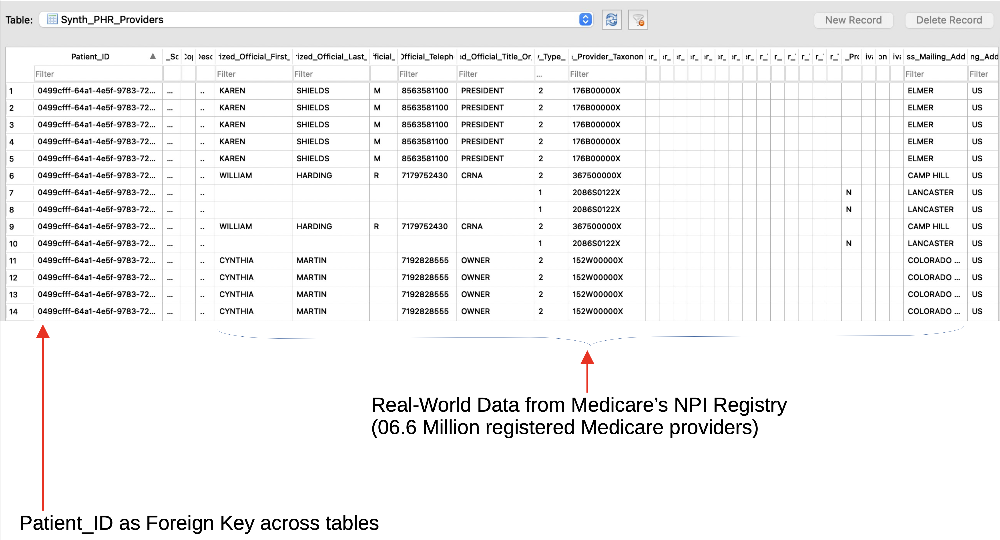

# Synthetic Personal Health Records ("SynthPHR")

Complete Personal Health Record (“PHR”):
* Conditions: SNOMED-CT CORE (5,316 Findings) Devices: FDA’s Approved Devices
* Drugs: FDA’s NDC
* Treatments: SNOMED-CT
* Lab Results: LOINC
* JSON, SQLite3 output. Could generate HL7, FHIR.

[Sample Synthetic PHR file in JSON format](http://nihpo.com/synthphr.json)

## Sections

### Demographics

### Conditions

### Devices

### Drugs

### Lab Results

### Procedures

### Providers

### Vitals

# License Notice
Please note that this software is licensed under the [GNU AGPL](https://www.gnu.org/licenses/why-affero-gpl.html).

[Contact NIHPO](mailto:Jose.Lacal@NIHPO.com?subject=GitHub%20inquiry.) for a commercial license, or if you're interested in licensing a customized version of this platform.

:copyright: 2007-2021 NIHPO, Inc.     Version 29 March 2021.