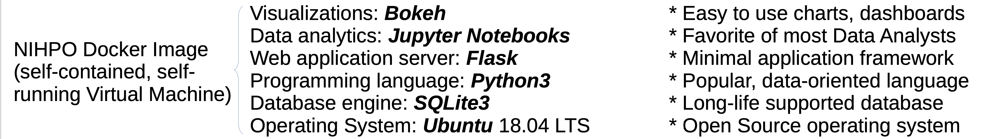
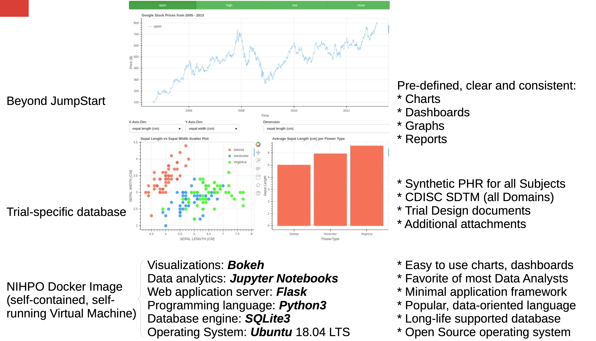

# Synthetic Regulatory Submission ("SynthSubmission")

The current process for submitting clinical trial data to regulatory agencies is sometimes referred to as "Digitized Paper."

Would there be any FDA interest in supporting the development of an "Interactive Safety Review" system?

This Interactive Safety Review would:
* Allow regulators to "see" submitted data in an interactive manner (charts, graphs, dashboards).
* Support long-term (10-20 years) access to data. Data (and the platform itself) would be usable as long as regulators need access.
* Pharma companies will be able to easily to share private data with regulators in a dynamic, interactive manner.
* Expedite review of approval process.

This proposed interactive submission tool will help improve the submission process. From today’s world of "Digitized Paper" to tomorrow’s of interactive data analysis and display.

What happens when there are no standardized computable submission bundles?
* Reviewers spend a lot of time just becoming familiar with each dataset / format / tool.
* Even with good software tools, it is difficult to work with non-computable submissions
* Reviewers need a lot of programming support, which may not be readily available

Standardize from the start:
* Reviewers spend less time becoming familiar with data up front, and more time reviewing
* Regulators can create software tools to help them review the data
* Software allows regulators to review individual submissions more effectively
* Supports a data repository that will allow regulators to review aggregated data

"Reliance on 'Digitized Paper' is slowing drug development."

* Common User Interface
* ARDs: Analysis Results Datasets. Have your data pre-calculated.
* How to connect with other HAs?

“Executable Submission Package” Docker image
Allow regulators to “see” submitted data in an interactive manner (charts, graphs, dashboards).
Open Source software guarantees long-term (10- 20 years) access to data, working system.
Sponsors will be able to easily share private data with regulator in dynamic, interactive manner.
Greatly expedite review and approval process.

## Base Docker Container

## Trial-specific Database

## Full Submission

# License Notice
Please note that this software is licensed under the [GNU AGPL](https://www.gnu.org/licenses/why-affero-gpl.html).

[Contact NIHPO](mailto:Jose.Lacal@NIHPO.com?subject=GitHub%20inquiry.) for a commercial license, or if you're interested in licensing a customized version of this platform.

:copyright: 2007-2021 NIHPO, Inc.     Version 29 March 2021.