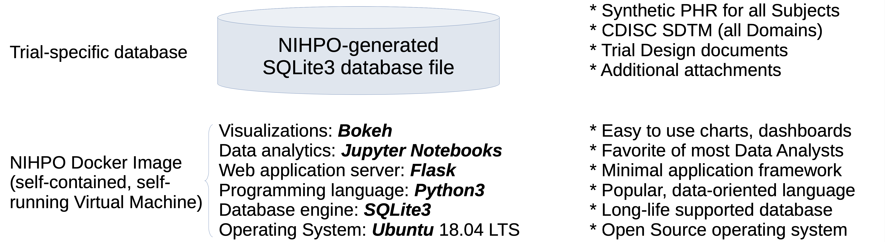

# Synthetic Regulatory Submission ("SynthSubmission")

“Executable Submission Package” Docker image
Allow regulators to “see” submitted data in an interactive manner (charts, graphs, dashboards).
Open Source software guarantees long-term (10- 20 years) access to data, working system.
Sponsors will be able to easily share private data with regulator in dynamic, interactive manner.
Greatly expedite review and approval process.

## Base Docker Container

## Trial-specific Database

## Full Submission

# License Notice
Please note that this software is licensed under the [GNU AGPL](https://www.gnu.org/licenses/why-affero-gpl.html).

[Contact NIHPO](mailto:Jose.Lacal@NIHPO.com?subject=GitHub%20inquiry.) for a commercial license, or if you're interested in licensing a customized version of this platform.

:copyright: 2007-2021 NIHPO, Inc.