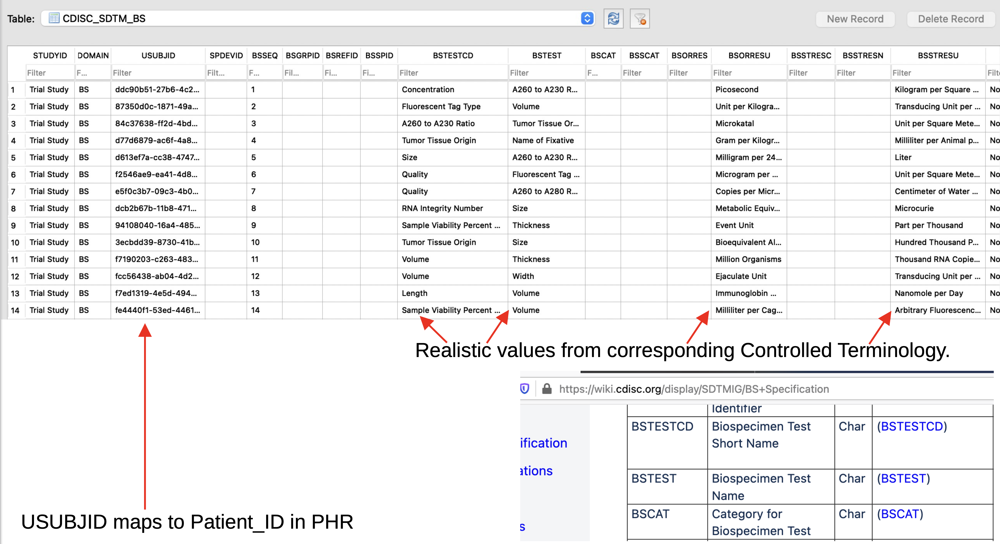

# SynthTrial

## Sample Files

Here are 03 full Synthetic Trials, with the corresponding Synthetic PHRs. Including all CDISC SDTM domains. 
Each package below includes CSV, SAS an SQLite3 database files.

[100 Subjects](http://nihpo.com/SDTM_100.zip)

[1,000 Subjects](http://nihpo.com/SDTM_1000.zip) [47 MB]

[10,000 Subjects](http://nihpo.com/SDTM_10000.zip) [471MB]

[Download the free SQLite3 viewer](https://sqlitebrowser.org/)

# Acknowledgement

We want to acknowledge the guidance and support from the PHUSE TDF Working Group. In particular: Dante Di Tommaso and Peter Schaefer. As well as: Cynthia Stroupe, Jessica Dai, Nancy Brucken, and Alexey Kuznetsov.

# License Notice

Please note that this software is licensed under the [GNU AGPL](https://www.gnu.org/licenses/why-affero-gpl.html).

[Contact NIHPO](mailto:Jose.Lacal@NIHPO.com?subject=GitHub%20inquiry.) for a commercial license, or if you're interested in licensing a customized version of this platform.

:copyright: 2007-2021 NIHPO, Inc.